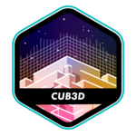
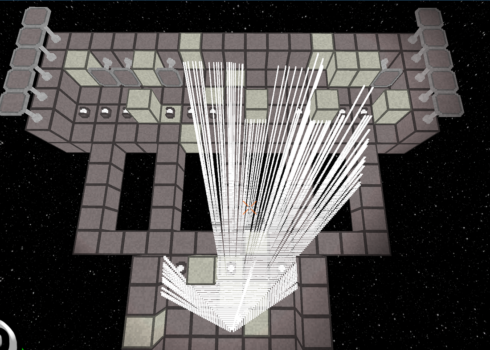
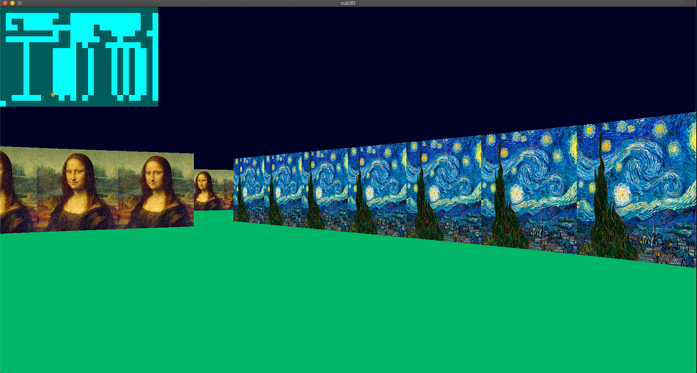

# <div align="center">cub3D</div>

<p align="center">
  
</p>

Cub3D is a 42 school team project to create a dynamic view inside a 3D maps. Using the [MiniLibX library](https://github.com/42Paris/minilibx-linux), we must implement raycasting in the style of the famous [Wolfenstein 3D](http://users.atw.hu/wolf3d/) game, the first true FPS in videogame history.
This project is collaborative of [Taha Braymi](https://github.com/shwanthefows) and Me.

## Clone

Clone the repository including the MiniLibX submodule:

```shell
git clone https://github.com/HYYPNNOSS/Graphic-3d-Raycasting.git
```

## Compile and Run


To compile the program, `cd` into the cloned directory and:

```shell
make
```

To run the program:

```shell
./cub3d maps/**anymap you want just make sure to add .ber at the end**
```

The program takes a map file as an argument. Maps are available in the `maps` directory. There are good maps which the program should run smoothly with, and bad maps which the program should reject.


## Controls

Controls for movement and rotation are:

- `W`: move forward
- `S`: move backward
- `A`: strafe left
- `D`: strafe right
- `left arrow`: rotate left
- `right arrow`: rotate right

## Useful Resources

Useful resources for this project are:

- Minilibx: [hsmits MiniLibX documentation](https://harm-smits.github.io/42docs/libs/minilibx)
- Minilibx: [gontjarow's MiniLibX tutorial](https://gontjarow.github.io/MiniLibX/)
- Xlib (for MLX events): [The Xlib Manual](https://tronche.com/gui/x/xlib/)
- Raycasting: [Lode's Computer Graphics Tutorial - Raycasting](https://lodev.org/cgtutor/raycasting.html)
- Raycasting: [Permadi's Raycasting tutorial](https://permadi.com/1996/05/ray-casting-tutorial-table-of-contents/)
- Movement: [Calculating heading in 2d games: Using trigonometric functions part 1](http://gamecodeschool.com/essentials/calculating-heading-in-2d-games-using-trigonometric-functions-part-1/)

## This image below can give you an idea about visual raycasting

<p>
  
</p>

## This image can give you an idea about how the project look when executed

<p>
  
</p>

